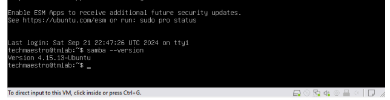
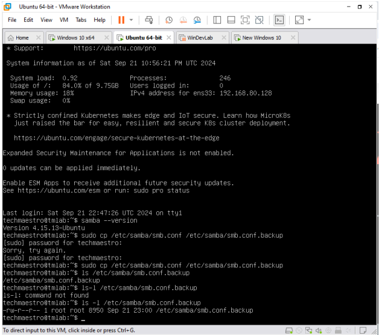
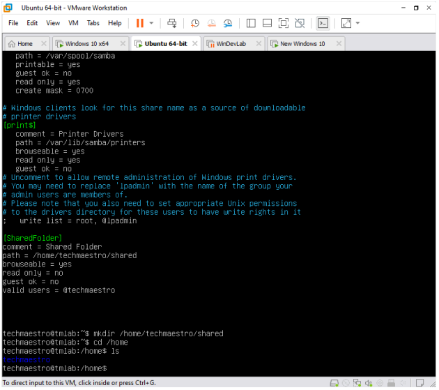
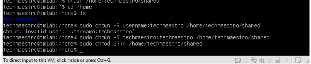
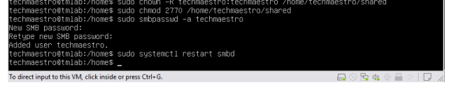
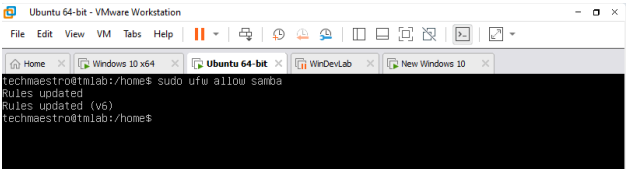
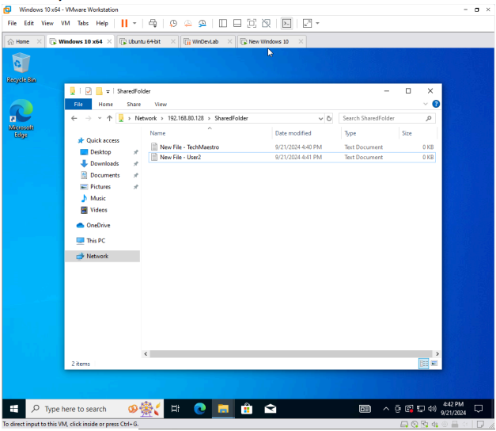

# 🧪 Cross-Platform File Sharing & Troubleshooting – Full Report

**Author:** Siraj Abdul-Shahid  
**Date:** 09/21/2024  
**Lab Type:** Entry-Level IT / File Sharing

---

## 📝 Objective

Configure and troubleshoot file sharing between a Linux (Ubuntu) virtual machine and two Windows 10 VMs using Samba. The goal was to establish a reliable shared folder accessible from both Windows systems over a virtual network.

---

## 🛠️ Lab Environment

- Ubuntu VM (file server)
- Two Windows 10 VMs (clients)
- Bridged or NAT virtual network
- IP example used: `192.168.80.128`

---

## 🔧 Configuration Steps

### 1. Update & Install Samba on Ubuntu
```bash
sudo apt update && sudo apt upgrade -y
sudo apt install samba
```
<details>
<summary>📸 View: Installed Samba Version</summary>



</details>

### 2. Backup Samba Config
```
sudo cp /etc/samba/smb.conf /etc/samba/smb.conf.backup
```
<details>
<summary>📸 View: Samba Config Backup Created</summary>



</details>

### 3. Prepare Windows VMs
- Cloned or added a second Windows 10 VM

- Ensured all VMs are on the same network

- Verified IP connectivity with ping

### 4. Create Shared Folder on Ubuntu
```
sudo mkdir -p /home/shared
sudo chmod 777 /home/shared
sudo nano /etc/samba/smb.conf
```
<details>
<summary>📸 View: Shared Folder and Directory Setup</summary>



</details>

<details>
<summary>📸 View: Permissions Updated on Shared Directory</summary>



</details>

### 5. Restart Samba
```
sudo systemctl restart smbd
```
<details>
<summary>📸 View: User Added and Samba Restarted</summary>



</details>

### 6. Configure Firewall
```
sudo ufw allow samba
```
<details>
<summary>📸 View: Firewall Rule Added for Samba</summary>



</details>

### 7. Connect from Windows VMs
- Used Windows File Explorer > Run:  
\\192.168.80.128\SharedFolder  
- Successfully accessed the shared directory from both Windows 10 VMs
<details>
<summary>📸 View: Successful Connection from Windows 10</summary>



</details>

### 🔍 Observations
- Both VMs were able to view and write to the shared folder  
- No authentication was required due to guest ok = yes  
- File sharing persisted after reboot  
- Ping tests confirmed stable network setup  
- Firewall and permissions were the most common blockers before resolution  

### 🧠 Lessons Learned
- Properly configuring Samba and its permissions is key to Windows/Linux interoperability  
- Guest-based shares are useful for testing, but not secure for production  
- Firewalls (especially on Ubuntu) must explicitly allow Samba  
- Network connectivity should always be verified first using ping  

### 🧰 Next Steps (Future Labs)
- Try using authenticated Samba shares (user-level access)  
- Mount Samba shares permanently on Linux or Windows  
- Experiment with SMBv1/v2/v3 and their security implications  

